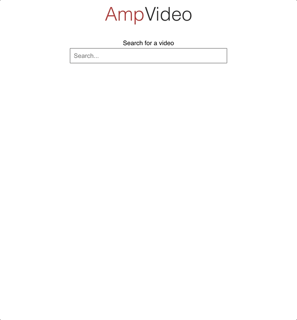

# AmpVideoReact demo app

<p align="center">
  
</p>

## Summary

This is a demo app that simulates a user searching for videos to watch.

Users search for a video to watch by typing search terms into a searchbar which compares the user's input to the videos' titles. If a video's title contains the search term (case insensitive), then the video is suggested to be viewed and appears as an option in the dropdown.

A user a can select a suggested video, and then that video's information is displayed on the page. The video's thumbnail image, title, number of views, and author are displayed beneath the list of videos. Upon choosing a video, the list disappears; the list reappears once the user starts searching for another video.

If a user's search term exactly matches the title of a video (case insensitive), then the user can press Enter to select that video.

If no matches are found between a search term and any video's title, then the only dropdown option is 'No suggestions' which cannot be selected.

Only the top 10 suggested videos are displayed to the user.

Suggested videos are ordered by their rank. Their rank is calculated using the following formula:

```
(estimated_seconds_watched / video_length_second) * number_of_views
```

## Technologies used

This app is comprised of a React app that serves as the UI on localhost:3001 and a Rails 6 app that serves as the API running on localhost:3000. The sample data is seeded upon running `rails db:setup` in `ampvideoreact/api`, and the app uses a SQLite database which comes standard with Rails apps.

I scaffolded out the UI using create-react-app and scaffolded out the back end by generating a Rails API.

## Run the app for yourself

Clone this repo if you'd like to run the app locally for yourself.

I built this app on a Mac with the following technologies installed: React 17, Node 17, Ruby 3, and Rails 6. Trying to run this app on a different kind of machine or with different versions of the technologies may yield different results.

In `ampvideoreact/user-interface` run
`npm i` then `npm start`. The UI should be running on localhost:3001 now. It's important to run on this port to avoid CORS issues.

In `ampvideoreact/api` run `bundle install`, `rails db:setup`, and `rails s`. <em>Note: The command `rails db:setup` may take a little while; there are a lot of records to create.</em>

Your API should now be running on localhost:3000. This port is important because the UI will be sending API calls to this specific port.

## What I would do next

- unit test the front end components using Jest.
- move the logic in the VideosController into a separate file and unit test it using rspec.
